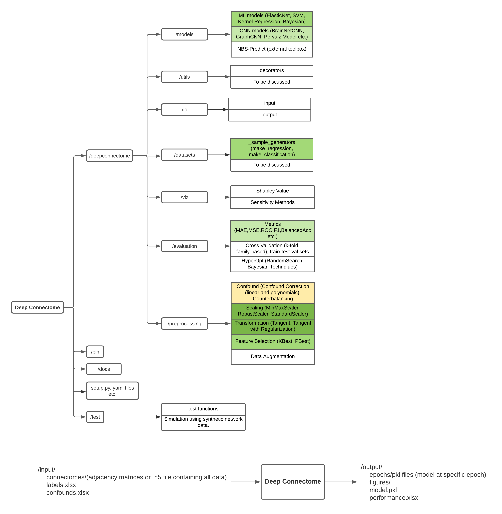

# DeepConnectome

Deep Connectome is a python toolbox to make connectome-based predictions using graph-based deep neural network algorithms.

## Overview

Deep Connectome allows users to perform predictions from connectivity matrices (task-based resting-state, or multi-layer) using BrainNetCNN, FNN, Recurrent CNN, and generic machine learning algorithms (e.g., Ridge Regression, SVM, Gaussian Process Regression). The toolbox includes model evaluation, preprocessing (e.g., scaling, transformation), feature selection for generic machine learning algorithms, hyperparameter optimization.

## Development Progress

The toolbox is currently **under development** and not ready to use! The diagram below shows the progress of development. Colors in the diagram depict different levels of development progress - yellow color represents the module is being developed; green color represents the development is partly (light green) or fully (dark green) done! 

 

## Versioning

We use [SemVer](http://semver.org/) for versioning. For the versions available, see the [tags on this repository](https://github.com/eminSerin/DeepConnectome). 

## Authors

Deep Connectome was designed by Emin Serin, Adu Matory, Andrew Zalesky, Johann D. Kruschwitz, and Henrik Walter. The initial version of the toolbox was developed by Adu Matory [BrainNetCNN_Personality](https://github.com/furtherAdu/BrainNetCNN_Personality), and it is currently being developed by Emin Serin. 

## Contributing

You may contribute in this project in many ways such as bringing new features to Deep Connectome, improving documentatation, or reporting bugs. See the [CONTRIBUTING.md](CONTRIBUTING.md) file for details.

## License

This project is licensed under the GNU General Public License v3.0 - see the [LICENSE.md](LICENSE.md) file for details.

